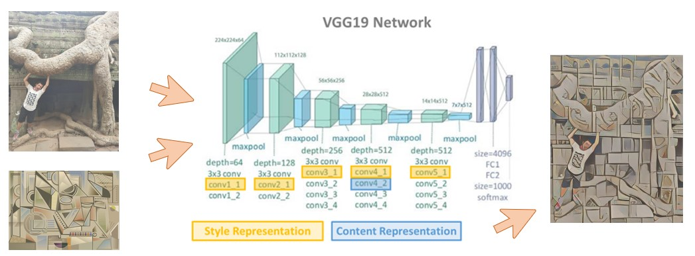

# Neural Transfer Style - Art Network
## The use of Convolutional Neural Networks

Neural Style Transfer is an interesting optimization techniques in deep learning. It merges two images, namely: a **"content" image (C)** as a base image and a **"style" image (S)** of the different picture (usually artistic), to create a **"generated" image (G)**. The generated image G combines the "content" of the image C with the "style" of image S.

To do this, we use an pretrained VGG-19 deep convolutional neural network.

This is achieved through the optimization of a loss function that has 3 components:

1. **total variation loss** imposes local spatial continuity between the pixels of the combination image, giving it visual coherence.
2. **style loss** is where the deep learning keeps in --that one is defined using a deep convolutional neural network. Precisely, it consists in a sum of L2 distances between the Gram matrices of the representations of the content image and the style image, extracted from different layers of a convnet (trained on ImageNet and the layers extracted is called  *Style Representation*). The general idea is to capture information (color/texture) at different spatial scales.
3. **content loss** is a L2 distance between the features of the content image and the feature (*Content  representation*).

## How does it work?

1. Load the content and the style image
2. Load the VGG19 model
3. Run the content image through the VGG19 model and compute the content loss
4. Run the style image through the VGG19 model and compute the style loss
5. Compute the total variation loss
6. Define the optimizer and the learning rate
7. Initialize the TensorFlow graph and run it for a large number of iterations, updating the generated image at every step.

## There are a faster way to compute

There is an Lite Tensorflow version includes a preprocess algorithm